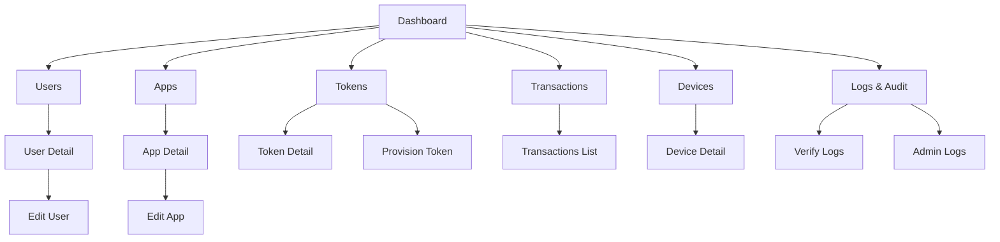

# Retails Tech Smart OTP Admin Portal

Bảng điều khiển quản trị Retails Tech Smart OTP cho các đối tượng: người dùng, ứng dụng, token, chính sách, thiết bị và audit logs. Dự án xây dựng bằng Next.js (App Router), TypeScript, Ant Design và Tailwind.

## Yêu cầu hệ thống

- Node.js tương thích với Next.js 16 (khuyến nghị Node 18 LTS).
- npm hoặc pnpm.

## Cấu hình môi trường

- `NEXT_PUBLIC_OTP_API_BASE`: base URL cho API thật.
  - Không set biến này sẽ tự động dùng mock data.
  - Ví dụ: `NEXT_PUBLIC_OTP_API_BASE=https://otp-api.example.com`

## Tổng quan giao diện

- **Bố cục**: 2 cột gồm sidebar và vùng nội dung, top bar cố định.
- **Sidebar**: Điều hướng chính; header cố định, menu tự cuộn khi dài.
- **Card & Table**: Màn hình dữ liệu sử dụng Antd Card, Table và Descriptions.
- **Màu sắc**: Màu thương hiệu `#E35561` và Tag trạng thái (xanh/vàng/đỏ).
- **Ngôn ngữ**: Hỗ trợ EN/VI (đổi nhanh trên top bar).

## Màn hình & chức năng (Smart OTP Admin)

- **Dashboard**
  - Tổng quan số lượng user/token, trạng thái token, tỷ lệ verify fail.
  - Hoạt động verify gần đây và các cảnh báo/pendings.
- **Users**
  - Danh sách user theo App/Group/Status; tìm kiếm theo User ID.
  - Thao tác hàng loạt: lock/unlock/reset OTP.
  - Trang chi tiết: Profile, Tokens, Devices, Activity (verify + audit).
- **Apps**
  - Quản lý application (iboard, ibroker, ...), trạng thái Active/Paused.
  - Liên kết policy OTP cho từng app.
  - Trang chi tiết + chỉnh sửa ứng dụng.
- **Tokens**
  - Danh sách token theo User/App/Status.
  - Provision token mới, trạng thái Active/Locked/Inactive.
  - Chi tiết enrollment (secret/URI), chỉ xem một lần.
  - Ràng buộc: 1 token / user / app.
- **Devices**
  - Danh sách thiết bị gắn token, trạng thái Active/Revoked.
  - Trang chi tiết thiết bị (user/app liên quan).
- **Transactions**
  - Theo dõi giao dịch OTP theo user/device, trạng thái và thời gian hết hạn.
- **Logs & Audit**
  - OTP Verify Logs (result SUCCESS/FAIL).
  - Admin Audit Logs (action, target, status).
  - Bộ lọc + export CSV.

## Annotated Screenshots

> Ảnh placeholder đã đặt sẵn ở `docs/screenshots/` (SVG). Thay bằng ảnh thật khi có.

- **Dashboard**: `docs/screenshots/dashboard-annotated.svg`
- **Users List**: `docs/screenshots/users-annotated.svg`
- **User Detail**: `docs/screenshots/user-detail-annotated.svg`
- **Apps List**: `docs/screenshots/apps-annotated.svg`
- **App Detail**: `docs/screenshots/apps-detail-annotated.svg`
- **Tokens List**: `docs/screenshots/tokens-annotated.svg`
- **Token Detail**: `docs/screenshots/tokens-detail-annotated.svg`
- **Transactions**: `docs/screenshots/transactions-annotated.svg`
- **Devices**: `docs/screenshots/devices-annotated.svg`
- **Logs & Audit**: `docs/screenshots/logs-annotated.svg`

## Tài liệu bổ sung

- `docs/sitemap-wireflow.md`: sitemap + wireflow chi tiết.

## Sitemap (Simple)



## Chạy local

Cài dependencies (chọn 1):

```bash
npm install
# hoặc
pnpm install
```

Chạy dev server:

```bash
npm run dev
# hoặc
pnpm dev
```

Mở `http://localhost:3000`.

## Build & Lint

```bash
npm run build
npm run lint
```

## Cấu trúc thư mục chính

- `src/app`: routes (App Router).
- `src/components`: UI components dùng chung.
- `src/services`: service layer + endpoints + mappers.
- `src/mock`: mock API + fixtures.
- `src/locales`: i18n EN/VI.
- `src/constants`: hằng số chung.
- `src/utils`: hàm tiện ích.

## Quy ước i18n

- Tất cả text hiển thị đặt tại `src/locales`.
- Key dùng dạng phân cấp theo màn hình/chức năng.

## Mock data & API

- Khi `NEXT_PUBLIC_OTP_API_BASE` trống: dữ liệu lấy từ `src/mock`.
- Khi có base URL: gọi API thật qua `src/services`.

## Ghi chú

- Mock data dùng mặc định; service API-ready nằm ở `src/services`.
- Màu thương hiệu chính là `#E35561`.
